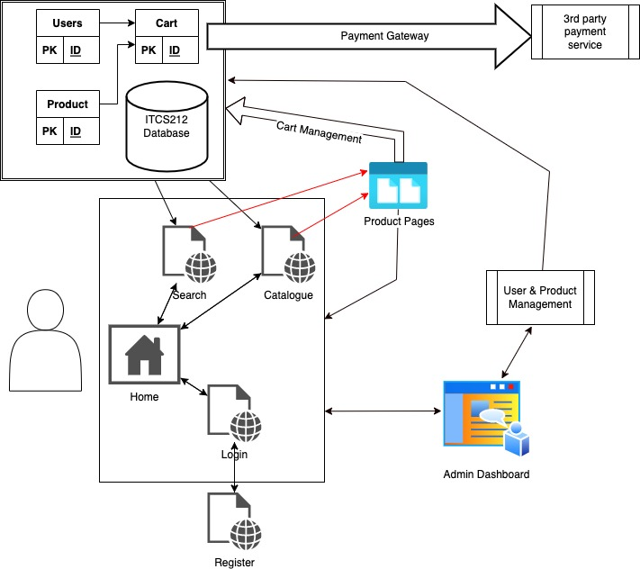
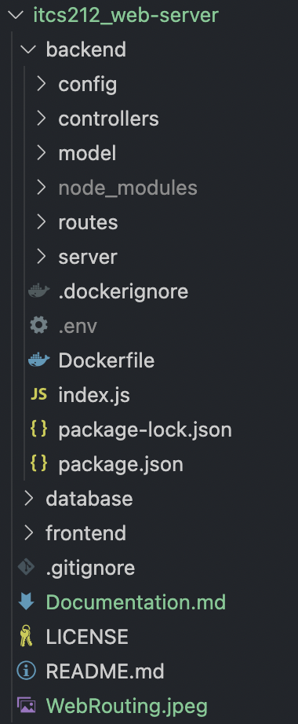
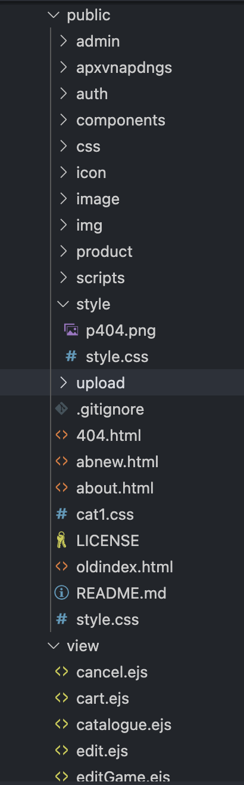
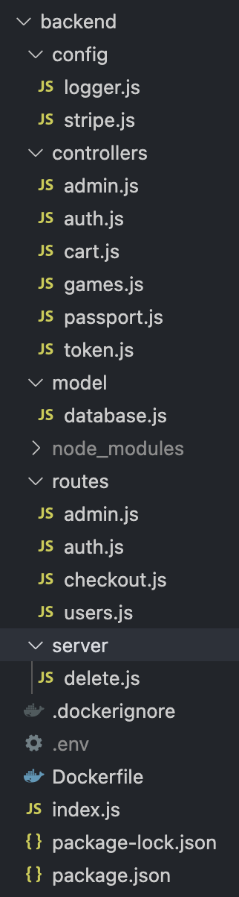

@Purinat33

# ITCS212 Web Server (OnlyGames)

## Description:
<p>This web server is part of the ITCS212 Web Programming course syllabus, built in the MVC format</p>

## Flow Overview:



## General Overview:
<ul>
<li>
    The home page group (Accessible from everywhere):
    <ul>
        <li>Homepage (/): Landing page of the website</li>
        <li>Browse (/store/browse): List of items</li>
        <li>About (/about): Information of the authors</li>
        <li>Search (/store/search): Items search page</li>
        <li>Login (/auth/login): Use for authentication</li>
    </ul>
</li>
<li>
    Product Specific Pages: 
    <p>Redirected from /store/browse or /store/search page. The URL of a product page is linked to its corresponding catalogue item.</p>
</li>
<li>
    Admin Pages:
    <ul>
        <li>Dashboard (/admin/dashboard): Contain lists of items and all users with abilities to edit and delete their details</li>
        <li>Product adding and User adding pages: Grants the ability to set username, password, and user status of either being an admin (granted access to the dashboard) or a normal user. Also allowed uploading of photos (jpeg) for product pages.</li>
    </ul>
</li>
<li>
    User's specific page (cart):
    <ul>
        <li>Contain information like titles, price per unit, number of units, and total price of a single product.</li>
        <li>Total price of everything summed together
        </li>
        <li>Checkout button leading to a payment gateway API by a 3rd party provider where a secured and trustworthy payment can occurred.
        </li>
    </ul>
</li>
</ul>

## MVC
<p>[MVC (Model-View-Controller)](https://developer.mozilla.org/en-US/docs/Glossary/MVC) is a pattern in software design commonly used to implement user interfaces, data, and controlling logic. It emphasizes a separation between the software's business logic and display. This "separation of concerns" provides for a better division of labor and improved maintenance.</p>

<ul>
    <li><strong>Model</strong>: Where our connection the database and exportation of the connection to other modules occurred</li>
    <li><strong>View</strong>: Where our EJS files (Embedded JavaScript), where retrieved data (from our database in this case) are rendered at runtime, allowing real-time displays of information like users and products. </li>
    <li><strong>Controller</strong>: This is where our program's behaviours like CRUD and authentications are performed.</li>
    <li><strong>Routes</strong>: Though not a literal part of the definition of MVC, we nontheless separate the routing and pathing of our web flows into a separate modules. The paths, working with the controller modules, specify the behaviours and where in our web would the corresponding behaviour performs.</li>
    <li>Config: Contain setting/initialization of packages like PassportJS, Stripe Payment API etc.</li>
</ul>

### An example of each MVC(RC) module and snippet:

database.js (Model)
```js
const sql = require('mysql2');
require('dotenv').config(); 

const db = sql.createPool({
    host: process.env.DB_HOST,
    user: process.env.DB_USR,
    password: process.env.DB_PWD,
    database: process.env.DB_NAME
});

db.getConnection((err, connection)=>{
  if (err) {
    console.error('Error getting connection from pool:', err);
    return;
  }
  console.log('Connection retrieved from pool:', connection.threadId);
  connection.release();
});
```

success.ejs (View)
```html
<div class="container">
        <h1>Success!</h1>
        <p>
            <%= message %>
        </p>
        <button id="continue-button">Continue</button>
    </div>
```

auth.js (Controller)
```js
const register = (req,res)=>{
    res.status(200).sendFile(path.join(__dirname, '..', '..','frontend', 'public', 'auth', 'register.html'));
}
```

auth.js (Routes)
```js
routes.get('/register', register);
```

stripe.js (Config)
```js
const session = await stripe.checkout.sessions.create({
    payment_method_types: ['card'],
    line_items: lineItems,
    mode: 'payment',
    success_url: `${process.env.SERVER_URL}/pay/success`,
    cancel_url: `${process.env.SERVER_URL}/pay/cancel`,
  });

  res.json({ id: session.id });
```

### Our goal is deploying the frontend and the backend separately on a different server/port:



<ul>
    <li>Views and static folder (containing images and other unchanged assets) are contain in the frontend folder.</li>
    <li>Model, Controller, Routes, and Config are stored in the backend folder.</li>
</ul>

# <strong>Frontend</strong>



## The frontend contains 2 folders: view and public
<ul>
<li>
    <strong>public</strong> 
    <p>The public folder is a standard folder in a web application that contains static assets such as images, CSS files, JavaScript files, and other resources that are directly served to the client-side (i.e., the user's web browser) when they visit a web page.</p>
    <p>
    The purpose of the public folder is to separate static files from dynamic files, such as server-side code that generates HTML dynamically. By separating these files, the server can serve the static files faster since it doesn't have to execute any code to generate them.
    </p>
    <p>
    In Node.js applications, the public folder is often located in the root directory of the project, alongside other folders such as routes, views, and models. When a client requests a file in the public folder, the server will directly serve that file without any processing or modification. </p>
</li>
<li>
    <strong>view</strong>
    <p>The views folder is a standard directory in a web application that contains the templates or views that are rendered by the server to generate the HTML that is sent to the client's web browser. The views folder is typically located in the root directory of the project, alongside other directories such as routes, models, and public.</p>
    <p>
    In a Node.js application that uses a templating engine like EJS or Handlebars, the views folder will contain files with extensions like .ejs or .hbs that define the structure of the HTML that the server sends to the client. These files contain placeholders or variables that are replaced by data when the server renders the view. For example, a view file might contain a variable like <%= username %> which will be replaced by the actual value of the username variable when the server renders the view.</p>
    <p>
    The views folder typically contains different files for different pages or components of the web application, such as the home page, login page, profile page, and so on. These files define the structure and layout of the HTML that is sent to the client and often include links to CSS and JavaScript files in the public folder.
    </p>
    <p>
    When a client requests a page from the server, the server will typically execute code in a routes file to generate or retrieve data to be displayed on the page, and then render the appropriate view file using the templating engine. The server then sends the resulting HTML to the client's web browser.</p>
</li>
</ul>

## EJS Files:
<p>EJS (Embedded JavaScript) is a templating language that allows developers to generate HTML dynamically with JavaScript. EJS is used in Node.js applications to generate dynamic web pages that can include variables, conditionals, and loops.</p>
<p>
In EJS, developers can write HTML code and embed JavaScript code within it using tags such as <% %> and <%= %>. The <% %> tags are used to execute JavaScript code, while the <%= %> tags are used to display the value of a JavaScript expression within the HTML output.</p>
<p>
EJS templates can also include partials, which are reusable code snippets that can be included in multiple templates. EJS partials are defined using the <%- include('partial-name') %> syntax.
</p><p>
When a Node.js application receives a request, the server processes the request and generates an HTML response using an EJS template. The server replaces EJS tags with their corresponding values and generates the final HTML output. This output is then sent back to the client's web browser as the response to the original request.</p>
<p>
Overall, EJS is a powerful tool for generating dynamic web pages in Node.js applications. It allows developers to create reusable templates that can be customized with dynamic data, making it easier to build complex web applications.
</p>

# <strong>Backend</strong>




The backend contains many folder, mainly Model, Controller, Routes and Config with additional files.

<ul>
    <li>
        <strong>package.json</strong>
        <p>package.json is a configuration file in a Node.js application that contains information about the application, its dependencies, and scripts to execute various tasks. It is typically located in the root directory of the project and is automatically created when a new Node.js application is initialized.</p>
        <p>
        The package.json file includes metadata about the application, such as the application name, version, description, author, and license. It also includes a list of dependencies and devDependencies, which are packages required by the application and development packages used during development, respectively. These dependencies can be installed using the npm or yarn package managers.</p>
        <p>
        In addition to dependencies, the package.json file includes scripts that can be executed using npm or yarn. These scripts can be used to start the application, run tests, build the application for production, and perform other tasks.
        </p><p>
        The package.json file also includes other settings that control the behavior of npm or yarn, such as the default version of Node.js to use, the location of the main entry point for the application, and configuration options for linters and other development tools.
        </p>
        <p>
        Overall, the package.json file is a central configuration file for a Node.js application that provides important metadata about the application, lists its dependencies and scripts, and provides other configuration settings.
        </p>
    </li>
    <li>
        <strong>package-lock.json</strong>
        <p>package-lock.json is a file created by npm when it installs dependencies for a Node.js application. It serves as a lock file to ensure that the application uses the same dependencies across different machines or environments.</p>
        <p>
        The package-lock.json file contains a detailed list of all installed packages, including their version numbers and dependencies. It also includes information about the installation process, such as the order in which packages were installed, the location of each package, and any warnings or errors encountered during installation.</p>
        <p>
        When a Node.js application is installed using npm install, npm reads the package.json file to determine the required packages and their versions, and then installs them in the node_modules directory. The package-lock.json file is then created to record the exact version numbers of each installed package, so that the application can be re-created with the same dependencies in the future.</p>
    </li>
    <li>
        <strong>index.js</strong>
        <p>The file starts by importing several required modules using the require function: express, session, method-override, path, morgan, dotenv, bcrypt, ejs, flash, body-parser, and cookie-parser. The express module is used to create and configure the HTTP server, while the other modules are used for tasks like logging, session management, security, and handling HTTP requests.</p>
    <p>
    The file then defines a database connection using the db object exported from the database.js module, and exports the db object to allow other files to join and query the database.
    </p><p>
    Next, the file checks if an admin user exists in the database and creates one if it does not already exist. This is done by hashing the admin password using bcrypt, querying the database for an admin user with the username "admin", and creating a new admin user if none exists.</p>
    <p>
    After that, the file defines routes for handling HTTP requests. These include routes for user actions, authentication, admin actions, and payment. The file also sets up middleware for handling cookies, sessions, and JSON data, and sets up the view engine to use EJS templates.</p>
    <p>
    Finally, the file defines routes for serving HTML pages, handles errors, and starts the server listening on the specified port. The main route (/) renders an EJS template called index with a context object that includes a user property, and the /about route serves a static HTML page. If a requested route is not found, the server responds with a 404 error page.
    </p>
    <li>
    ## List of middlewares in index.js
    <p>
    In the given index.js file, app.use() is used to add middleware functions to the Express application app. Here's a brief explanation of each app.use() function in the file:</p>
    <p>
    app.use(flash()): This adds the connect-flash middleware to the application, which allows for displaying flash messages on successful or failed operations.</p>
    <p>
    app.use(bodyParser.urlencoded({ extended: false })): This adds the body-parser middleware to the application, which parses incoming request bodies in a middleware and makes it available under the req.body property.</p>
    <p>
    app.use(methodOverride(req => req.body._method)): This adds the method-override middleware to the application, which allows for using HTTP verbs such as PUT or DELETE in places where the client doesn't support it (like in HTML forms).</p>
    <p>
    app.use(cookieParser()): This adds the cookie-parser middleware to the application, which parses cookies attached to the client request object.</p>
    <p>
    app.use(session({ ... })): This adds the express-session middleware to the application, which enables server-side session management. The middleware creates a new session object for each client, and stores the session data on the server.</p>
    <p>
    app.use(passport.initialize()): This adds the passport middleware to the application, which is an authentication middleware that provides various strategies for authenticating a user.
    </p><p>
    app.use(passport.session({ ... })): This adds the passport session middleware to the application, which allows passport to serialize and deserialize user instances to and from the session.
    </p><p>
    app.use(express.urlencoded({extended:false})): This adds the urlencoded middleware to the application, which parses incoming requests with urlencoded payloads.
    </p>
    <p>
    app.use(express.json()): This adds the json middleware to the application, which parses incoming requests with json payloads.
    </p><p>
    app.use(express.static(path.join(__dirname, '..', 'frontend', 'public'))): This serves static files, like images, CSS, JavaScript, etc., from the specified directory. This middleware serves files in the directory to the client, based on the URL path provided.
    </p><p>
    app.use(morgan('dev')): This adds the morgan middleware to the application, which logs incoming requests to the console in a developer-friendly format.
    </p><p>
    app.use((err, req, res, next) => { ... }): This adds an error handling middleware to the application, which catches and handles errors thrown by the application.
    </p><p>
    app.use((req, res, next) => { ... }): This adds middleware to the application to set the content type of the response to text/html if the request URL ends with .html.
    </p>
    <p>
    In summary, the app.use() function is used to add middleware to the Express application, which can perform various operations such as parsing request bodies, handling errors, and serving static files, among others.
    </p>
    </li>
    </ul>
    </li>

</ul>